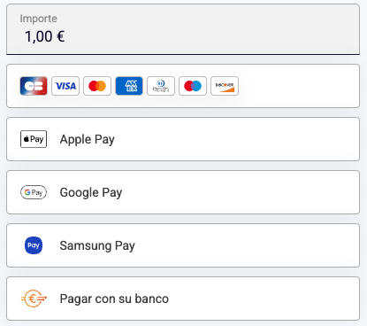

# Embedded Form samples

It's an experimental repository, It will be removed soon.

## run the project

Clone it and run:

    npm install
    npm run dev

and go to [http://localhost:5173/](http://localhost:5173/)

## single column

- [Javascript implementation example](./src/single_column/spa)
- [Classic implementation](./src/single_column/classic)

## button only payment form

- [Javascript implementation example](./src/single_column_only_buttons/spa)
- [Classic implementation](./src/single_column_only_buttons/classic)

## 2 columns

- [Javascript implementation example](./src/two_columns/spa)
- [Classic implementation](./src/two_columns/classic)

## 3 columns

## Icons only payment buttons

## Radio button mode

## payment method buttons in another place

## popIn (single button payment form)

## Currency conversion

## Split payment

## My own interface
